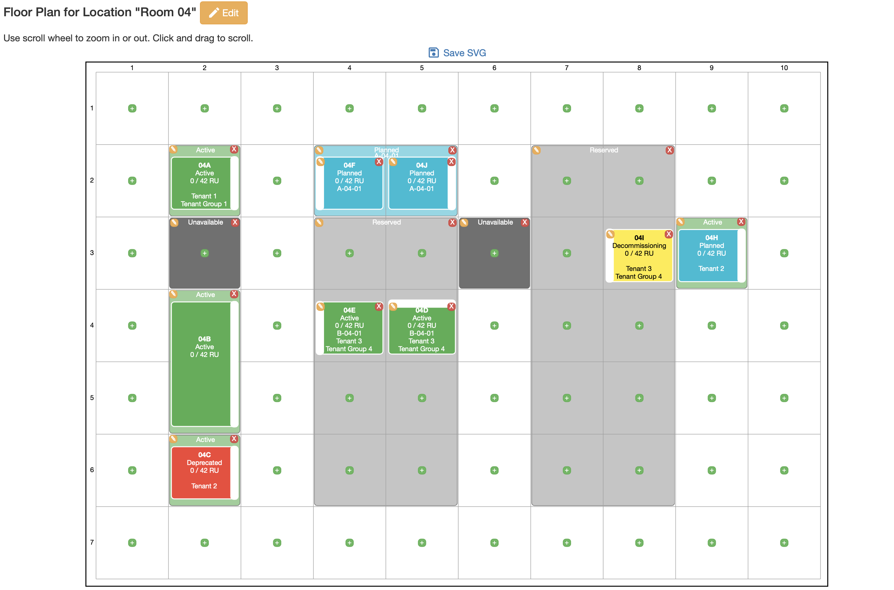

# Getting Started with the App

This document provides a step-by-step tutorial on how to get the App going and how to use it.

## Install the App

To install the App, please follow the instructions detailed in the [Installation Guide](../admin/install.md).

## First steps with the App

As a first step you will want to define which Status(es) can be applied to individual tiles in a floor plan. This can be done by navigating to "Organization > Statuses" in the Nautobot UI, and creating or updating the desired Status records to include `nautobot_floor_plan | floor plan tile` as one of the Status's "Content Types".

## What are the next steps?

For any [Location](https://docs.nautobot.com/projects/core/en/stable/core-functionality/sites-and-racks/#locations) defined within your Nautobot instance, you can navigate to the "detail" view for that Location and a new "Add Floor Plan" button will be present.

Clicking this button will bring you to a standard Nautobot create/edit form, in this case for defining parameters of the Floor Plan for this Location.

The "X size" and "Y size" parameters define the number of Tiles in the Floor Plan, and the "Tile width" and "Tile depth" parameters define the relative proportions of each Tile when rendered in the Nautobot UI. You can leave the tile parameters as defaults for a square grid, or set them as desired for a off-square rectangular grid.

After clicking "Create", you will be presented with a new floor plan render:

(This view will be accessible again in the future by navigating to the Location's "detail" view again and clicking the "Floor Plan" tab.)

You can click the "+" icon in the corner of any rectangle in the grid to define information about this Tile in the Floor Plan. (If you've defined a large floor plan, or have a small display, you may find it useful to use your mouse wheel to zoom in first. You can also click and drag when zoomed in to pan around the grid.) This will bring you to a simple create/edit form for describing the Tile.

You can assign a Status to each tile, and optionally assign a Rack or Rackgroup as well as specifying the orientation of the Rack relative to the Floor Plan. You can also specify the size of a Tile if you want it to cover multiple "spaces" in the Floor Plan - this can be useful to document larger-than-usual Racks, or to mark entire sections of the Floor Plan as "Reserved" or "Unavailable". 

You can place racks within the Status or Rackgroup tiles that are covering multiple spaces. It placing a Rack onto a Rackgroup tile, the rack must be added to the appropriate Rackgroup. Rackgroup and Status tiles that cover multiple "spaces" can be increased or reduced in size as long as they don't overlap with over status or Rackgroup tiles.

By repeating this process as many times as desired, you can populate the Floor Plan in detail to indicate the Status of each Tile as well as the position, Status, and space usage of your Racks:

